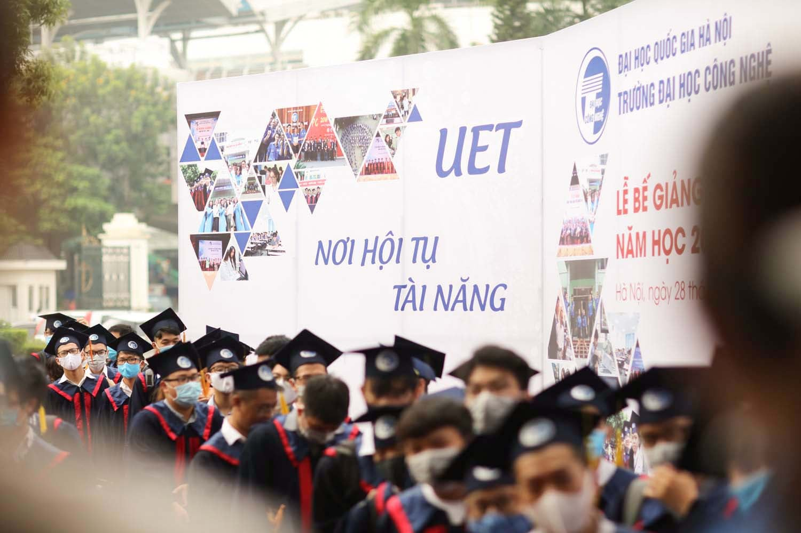
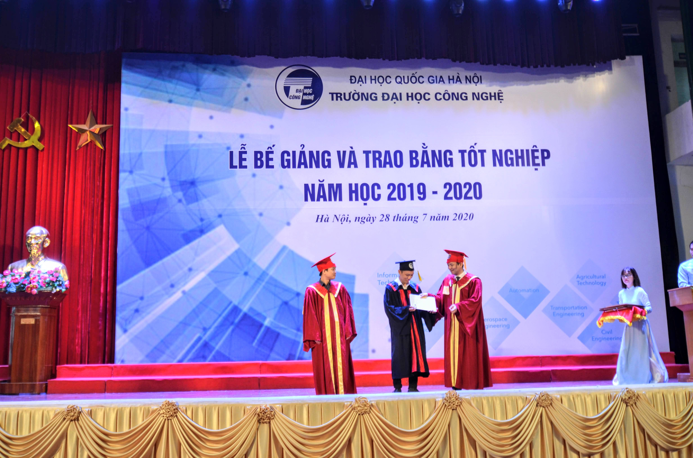
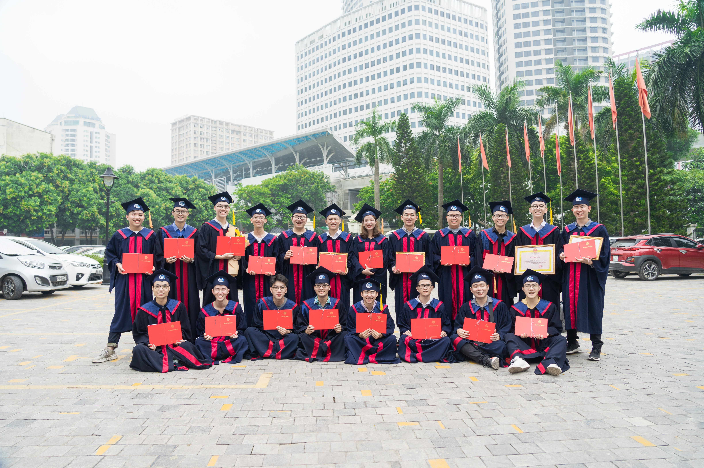
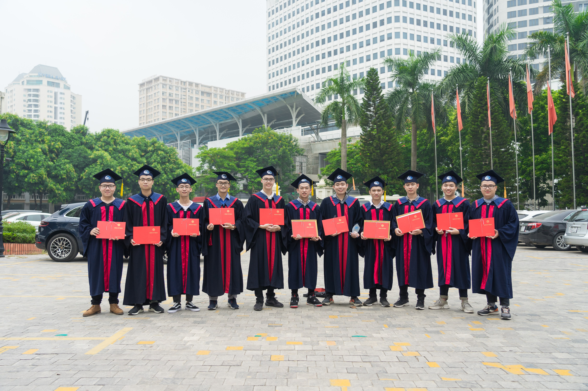
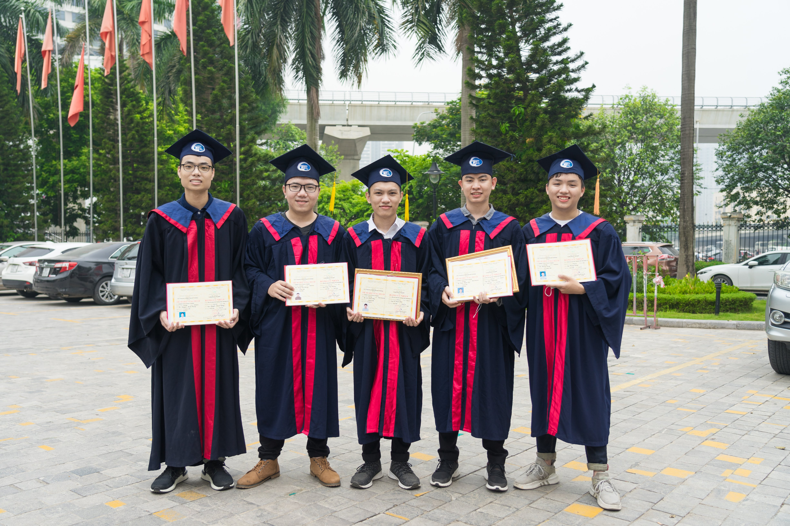
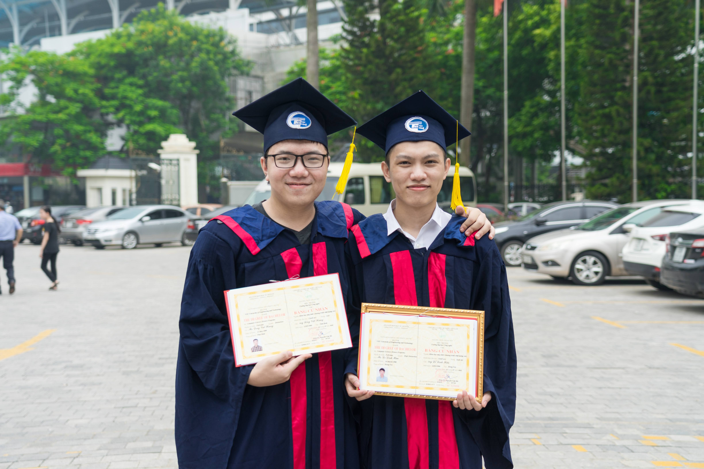
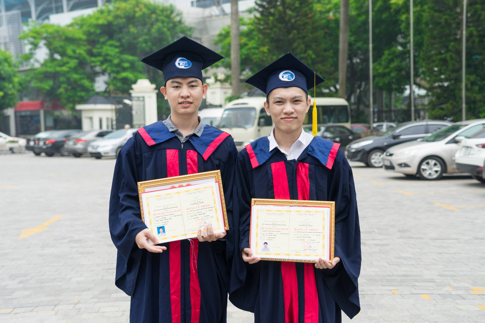
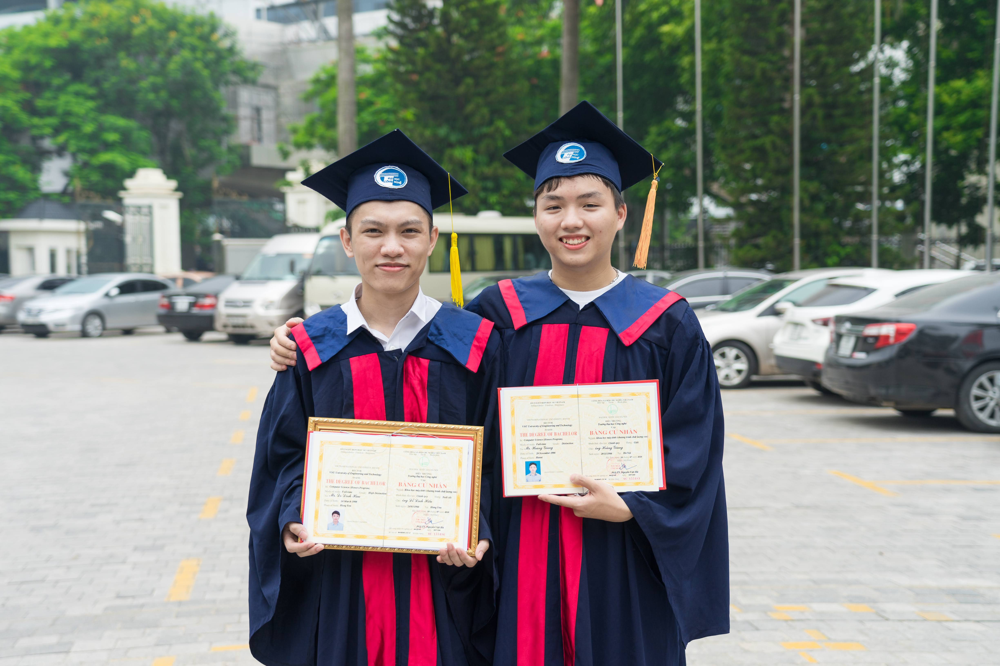
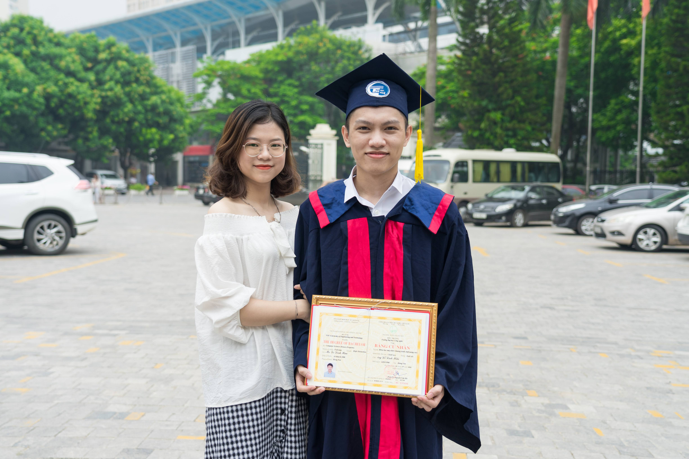

On July 28 2020, while the pandemic was being under control in Vietnam, University of Engineering and Technology, VNUH hosted in-person Graduation Ceremony for class of 2020.

Although the safety at that time, people wore masks for self-protection.

Below are my images on that memorable day.

Me receiving certificate from Dean of UET.

Taking photo with my classmates

(Front row: CuongNM, HungPD, GiangNT, Duc-Anh, GiangTT, HungPT, Hoang Ngo, HungLV,  
Backrow: Giang Hoang, HoangNV, Xuan-Anh, Hoang Le, HoangDV, Hieu, Linh, CuongNXV, Khai, Tuan-Anh Do, Tuan-Anh Dao, Midu)

My scholarship hunter group (a.k.a UET MSc.++ club)

(From left: HoangDV, CuongNM, Hoang Le, HoangNV, Xuan-Anh, CuongNXV, Hoang Ngo, Hieu, Midu, Giang Hoang, Khai)

My Machine Learning related group

My close friend, Hoang, PhD Candidate to-be at SMU

With single [Midu](https://ductm104.github.io/), now Tutor, Research Engineer, System Administrator at AI-lab, UET-VNUH

[Giang Hoang](https://www.linkedin.com/in/hoang-giang-533b94125/), now Vinnese (in Vietnamese: vin-nô)

Last and most important, my Luv, who has supported me for nearly one decade.

