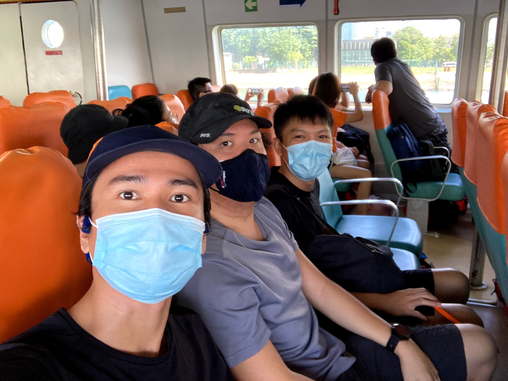
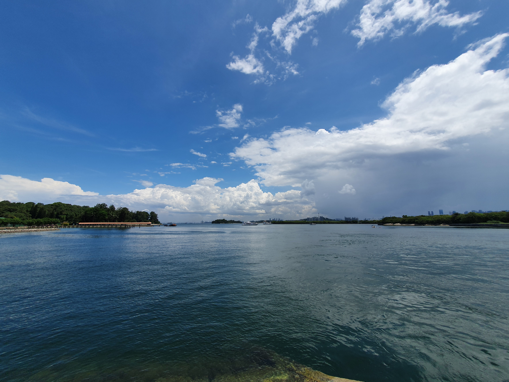
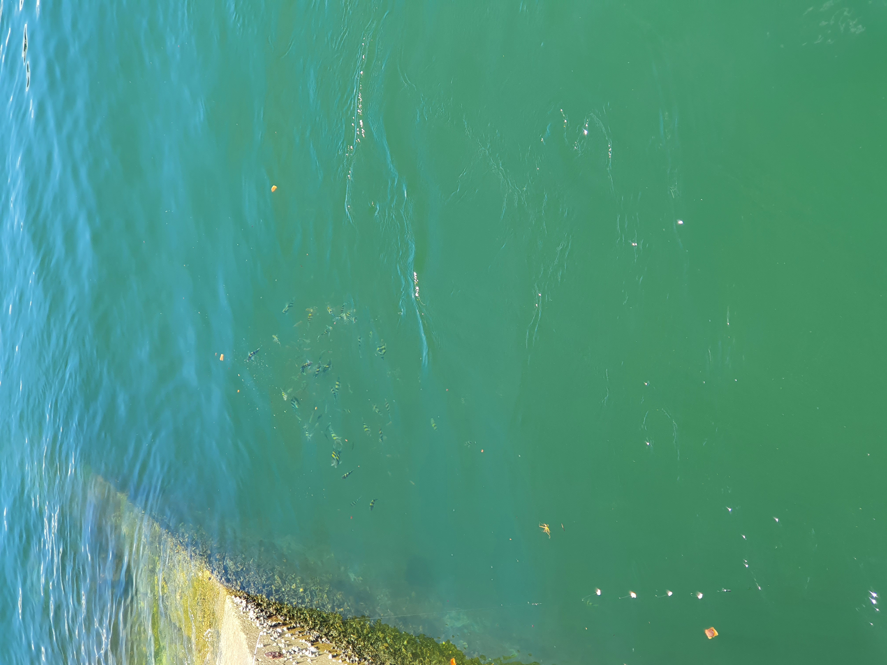
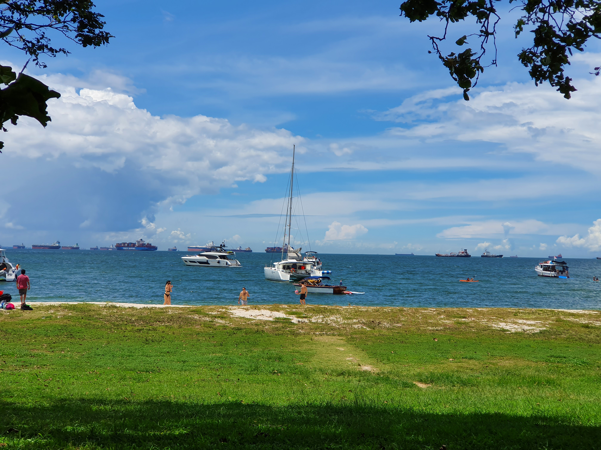
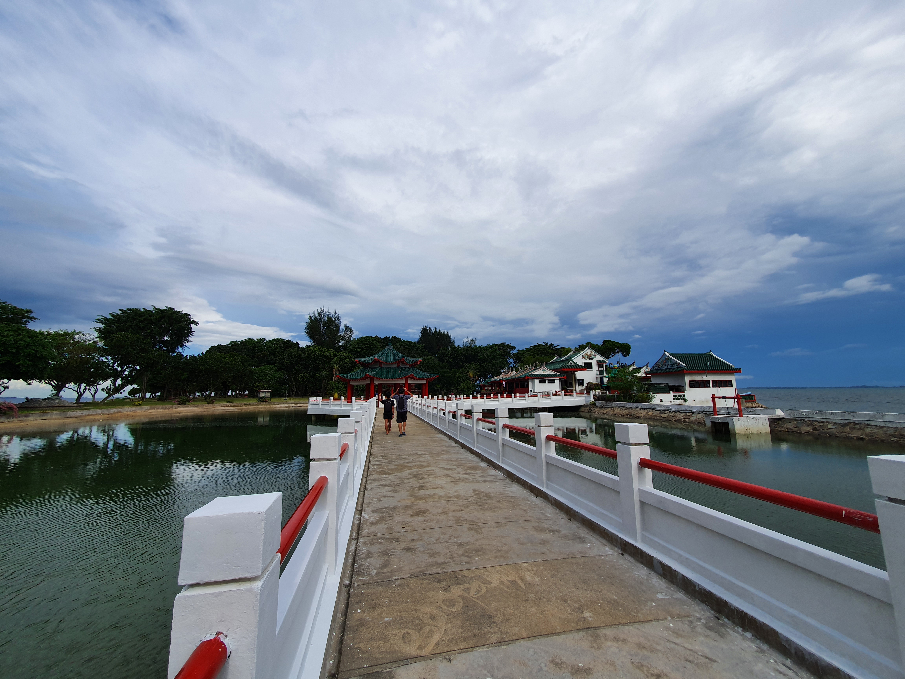
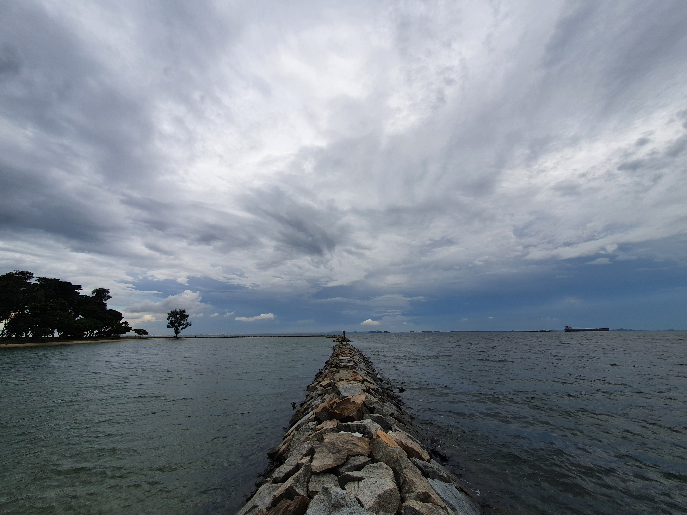
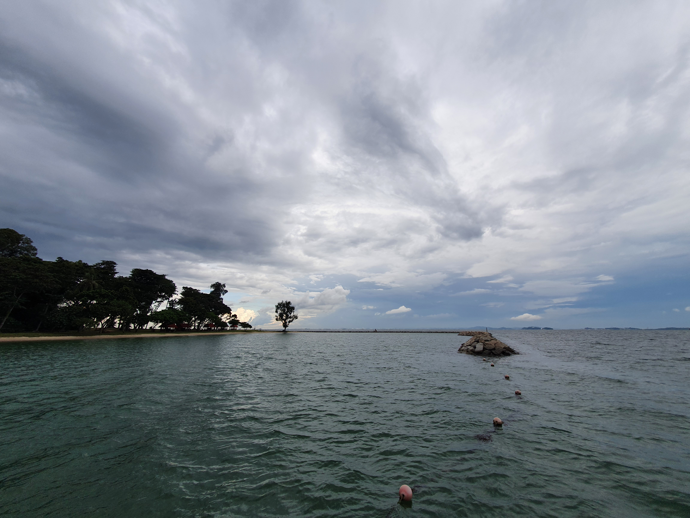
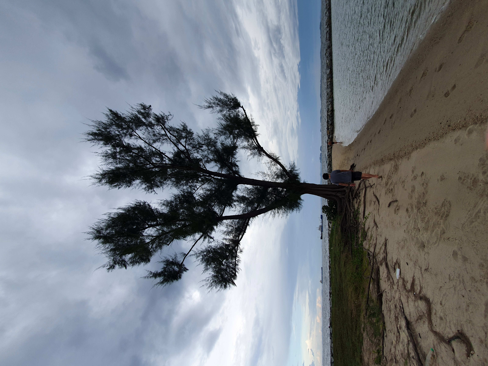
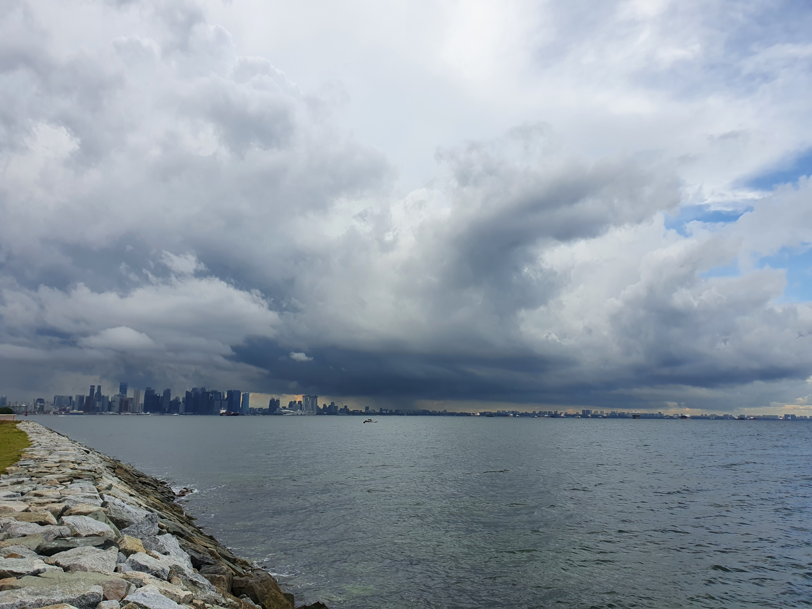
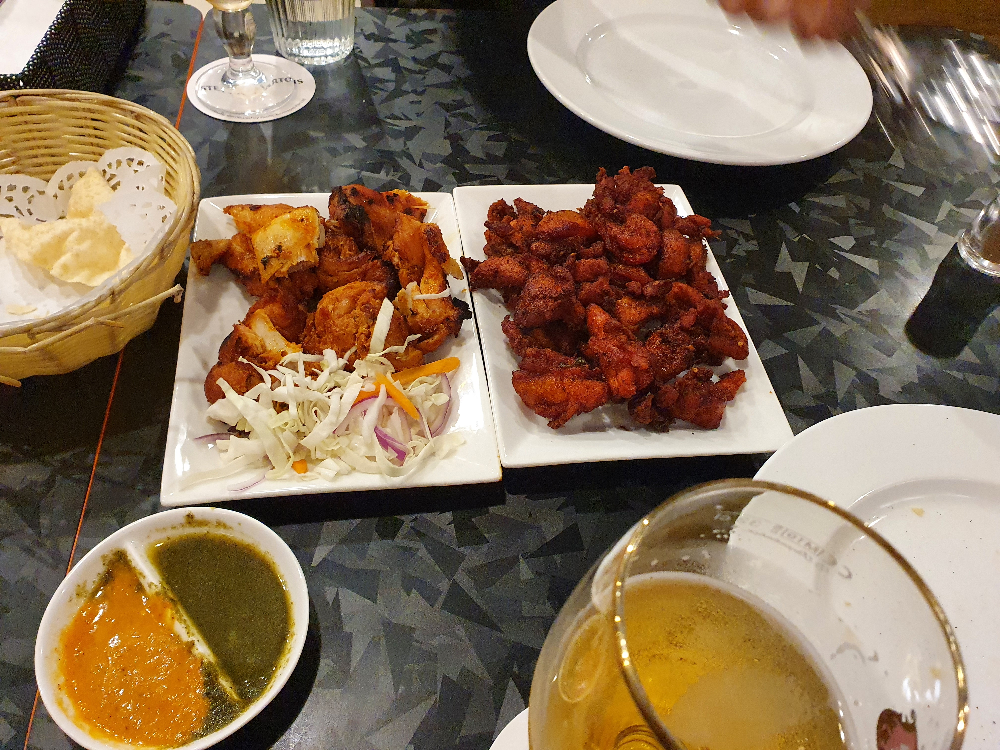

Earlier on today, Hoang, Quang and I went to St John Island. It is an archipelago which includes St John's, Lazarus and Kusu Islands. Below are some images of our trip.

On ferry ship to St John's Island

Welcome to St John's Island

View from St John - Lazarus Bridge

Fishes being fished below the bridge

Lazarus Island Beach

Kakuremino no Jutsu

Hoang and Quang taking photos at Kusu Chinese Temple

Kusu rock embankment

Quang walking towards lonely tree lonelily

Ships nearly reach horizon line

Rain at Marina Bay

Panorama shot

Latter, we had dinner @Himalaya Kitchen
