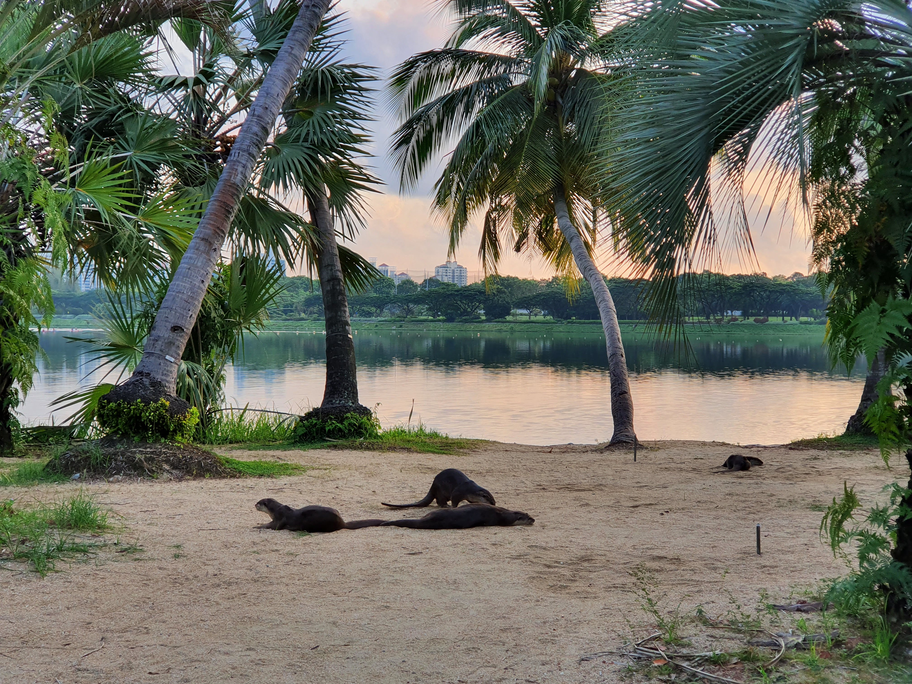
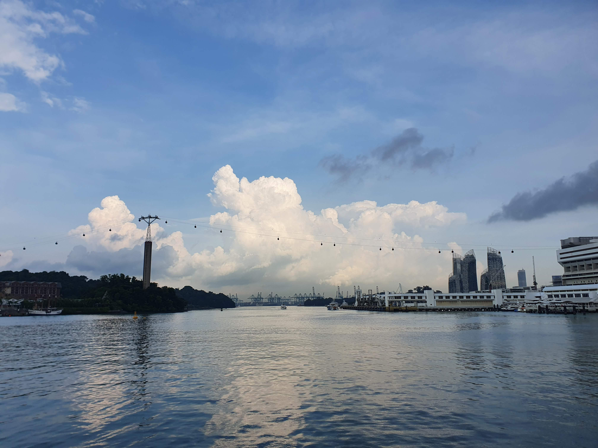
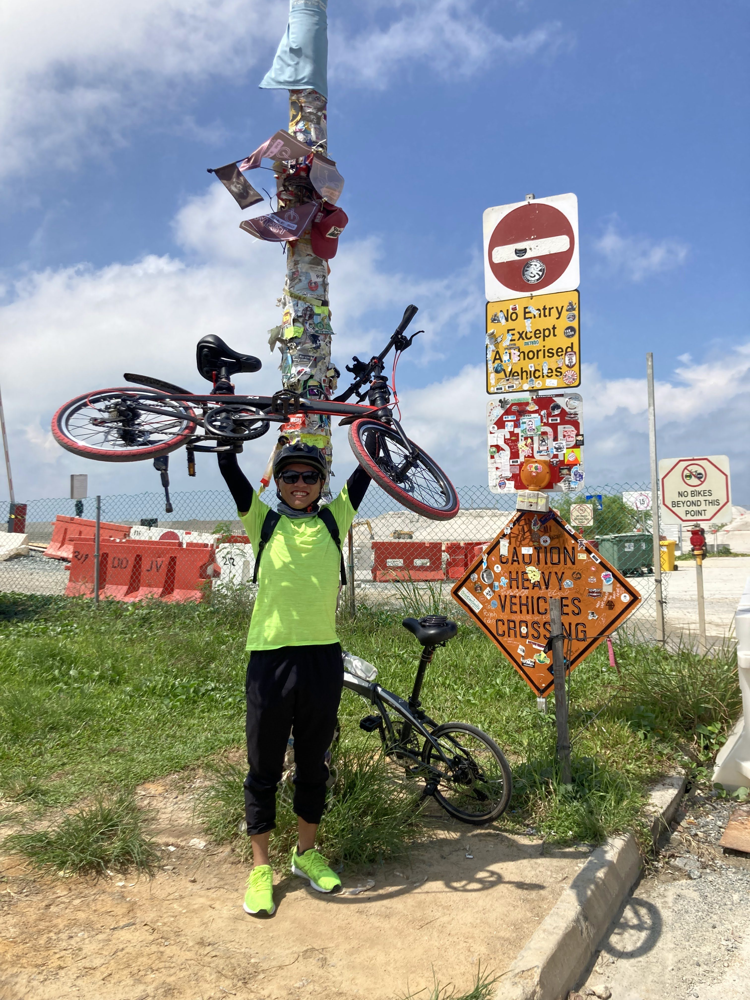
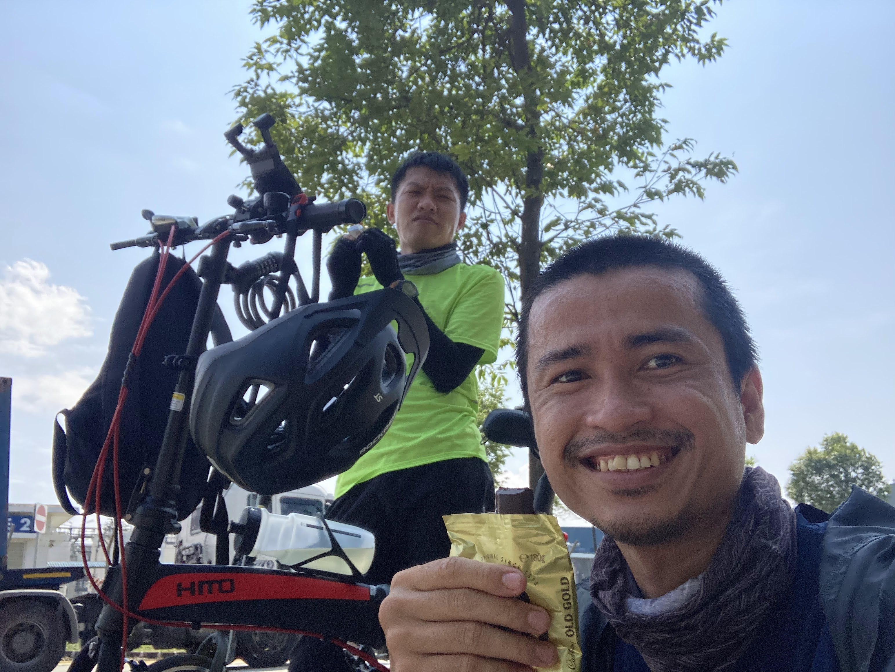
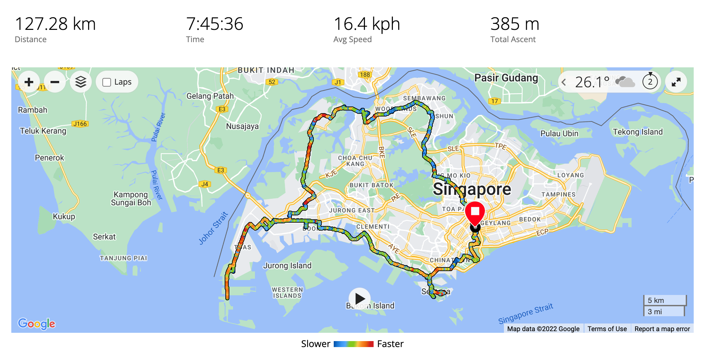

Earlier on sunrise, Hoang and I went cycling in pursuit of Round the Island challenge. It was a long (both time and distance) journey which assesses our endurance. The below images were captured during our trip.

We began the journey at nearly 7a.m in the morning, which is approximate sunrise time. We cycled through Stadium to Marina Bay, where the otters start their day by an early sunbath.

We then went straight to Sentosa, and do nearly one round of the resort island. The slope of Sentosa makes me burnt out of energy right at the start of the trip. We took a quick rest at Sentosa Broadwalk.

After that, we went on to reach Lamp Post 1, the West-est point of Singapore that cyclists can reach. On the way there, we catched rain sometimes and hide at the shelter or the bus stop. After the rain, when the clouds went away, it was so sunny and hot. The road to Lamp Post 1 is also full of lorries, trucks with sand and dust. We were protected with arms, neck cover, gloves and sunglasses. Thus, I looked like Moon Knight, avatar of Khonshu.

As an achievement, I lifted my bike and posed at Lamp Post 1. Up to LP1, we had achieved 60-km length.

The trip continued with sunlight, slope and wind which make both of us exhausted. We decided to cut off the trip and wouldn't reach Changi at 100-th kilometer. 

At the end, it was 120-km West-half journey.

And I had some time to relax with sunset sight.
